# 🎓 Sistem Akademik Sederhana

Aplikasi ini adalah sistem akademik sederhana berbasis web yang dirancang untuk mengelola data mahasiswa dan mata kuliah. 
Dengan antarmuka yang dinamis, admin dapat menambah, mengedit, dan menghapus data mahasiswa serta mata kuliah. 
Mahasiswa dapat melihat daftar mata kuliah yang tersedia dan mendaftarkan diri (enroll) ke mata kuliah pilihan mereka, yang kemudian akan tercatat di halaman Mycourse.

---

## ✨ Fitur Utama

* 🔧 **Manajemen Data (CRUD)**

  * Admin dapat **menambah, mengedit, dan menghapus** data mahasiswa maupun mata kuliah.
* 📝 **Pendaftaran Mata Kuliah (Enroll)**

  * Mahasiswa dapat memilih beberapa mata kuliah sekaligus dan melakukan **enroll**.
  * Data yang dipilih otomatis tersimpan dan ditampilkan di halaman **MyCourse**.
  * Validasi enroll: mahasiswa tidak bisa mendaftar dua kali pada mata kuliah yang sama.
* ⚡ **Tampilan Dinamis**

  * Daftar data mahasiswa maupun mata kuliah dapat ditampilkan secara **real-time** melalui manipulasi DOM dengan JavaScript.

---

## 🛠️ Teknologi yang Digunakan

### 🔹 Framework

* **CodeIgniter 4 (CI4)**
  Digunakan sebagai *backend framework* dengan pola **MVC (Model-View-Controller)**, sehingga logika, tampilan, dan data terpisah dengan rapi.

### 🔹 Bahasa Pemrograman

* **PHP**
  Berjalan di sisi server untuk menangani logika bisnis, interaksi dengan basis data, serta routing aplikasi.

### 🔹 Frontend

* **Vanilla JavaScript**

  * ✨ DOM Manipulation: membuat elemen HTML secara dinamis
  * ✨ Event Handling: menangani klik menu, submit form, dll
  * ✨ Validasi Form: mencegah input kosong, memberi pesan error, dan mempercantik UI

* **CSS**

  * Untuk styling tampilan: warna, layout, tombol, dan tabel.

### 🔹 Basis Data

* **MySQL**
  Menyimpan data mahasiswa, mata kuliah, serta riwayat enroll dengan struktur yang terorganisir.

---

## 🚀 Cara Kerja Singkat

1. **Admin** mengelola data mahasiswa & mata kuliah (CRUD).
2. **Mahasiswa** melihat daftar mata kuliah yang tersedia.
3. Mahasiswa melakukan **enroll** → data langsung tersimpan ke database dan tampil di halaman **MyCourse**.
4. Sistem memastikan **tidak ada double enroll** pada mata kuliah yang sama.

---

## 📸 Scrennshoot Program

### Halaman Login
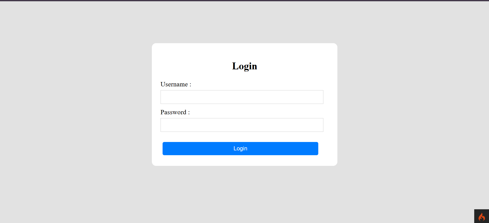

### Dashboard Mahasiswa
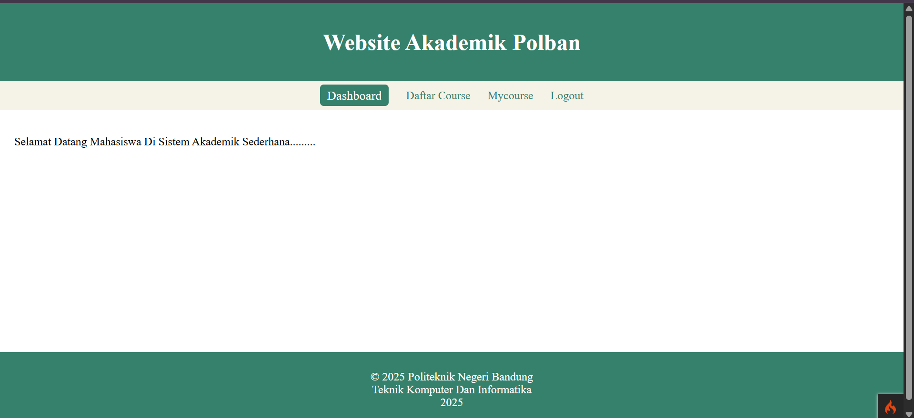

### Daftar Course Mahasiswa
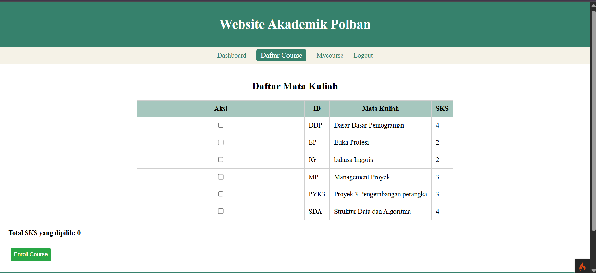 
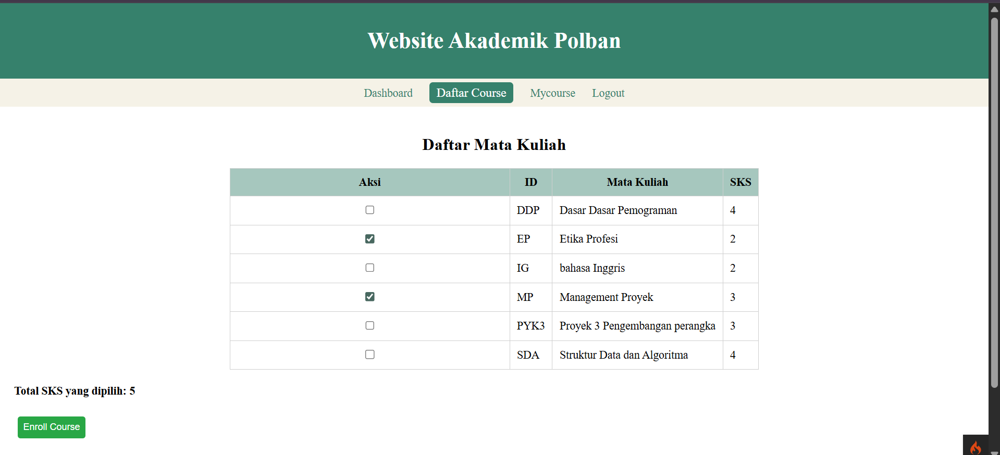

### My Course
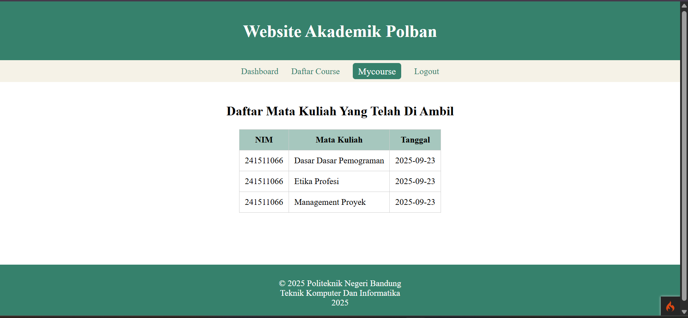

### Dashboard Admin
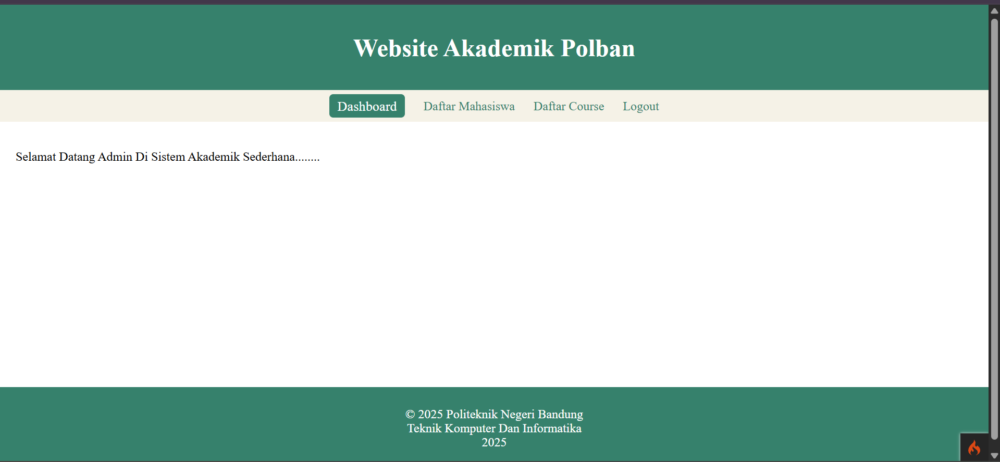

### Daftar Mahasiswa admin
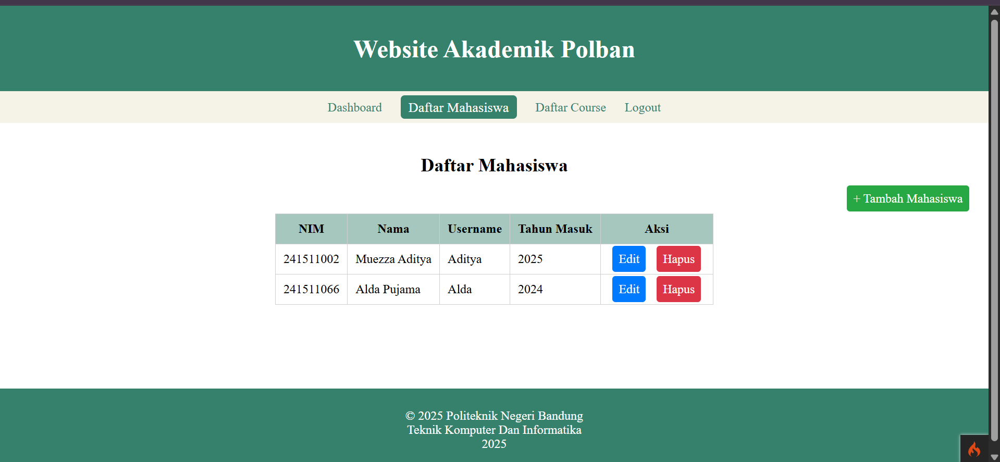

### Daftar Course admin
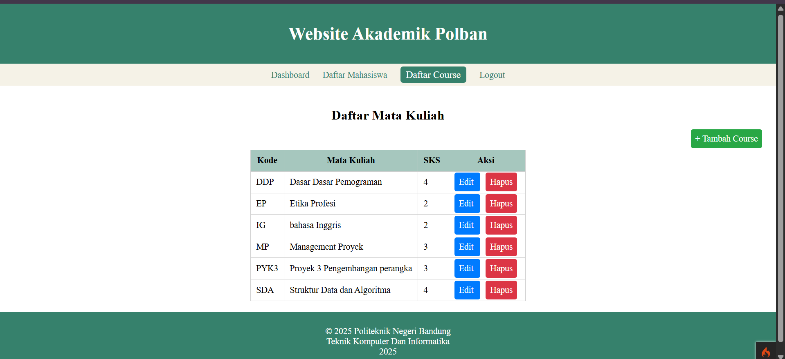

### Add
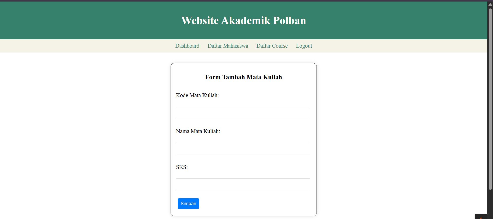

### Edit
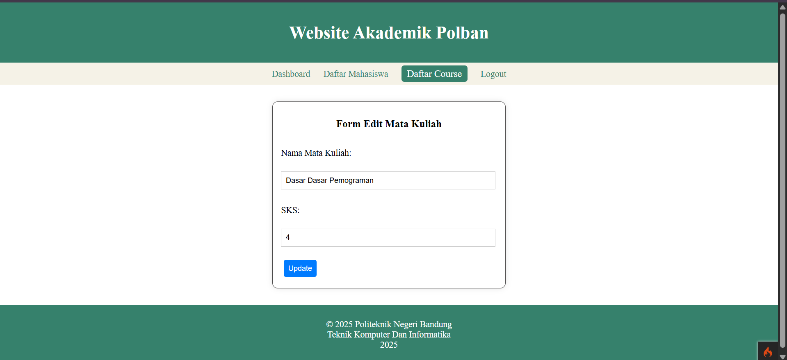

### Hapus
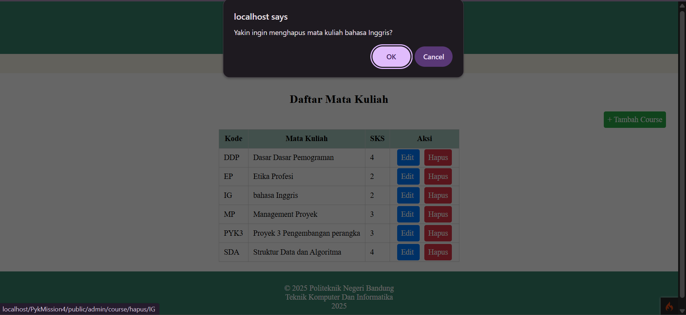

### Kosong
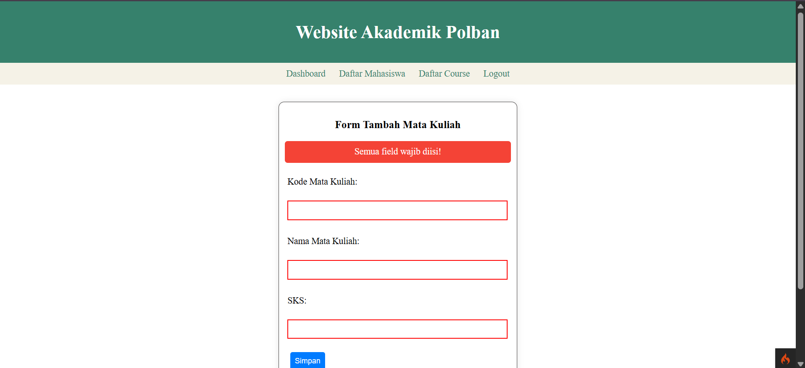